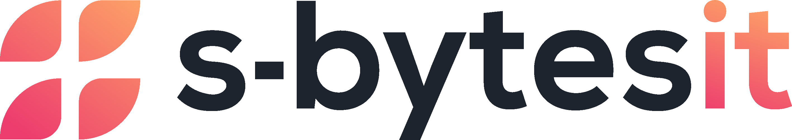

<p align="center">
  
</p>

<h1 align="center">Cüzhane</h1>

<p align="center">
  <strong>Read together, finish together.</strong><br />
  A group reading app for the Cevşen, the Kur'an and the Hizbü'l-Hakaik.
</p>

<p align="center">
  <a href="https://apps.apple.com/app/id6809141582">App Store</a> ·
  <a href="https://play.google.com/store/apps/details?id=com.cuzhaneapp.app">Google Play</a> ·
  <a href="https://cuzhane.sbytes-it.com">cuzhane.sbytes-it.com</a>
</p>

---

## What it does

A group shares one reading. The app divides it, keeps count, and shows how far everyone has got.

| Reading            | Shared as                                                                                        |
| ------------------ | ------------------------------------------------------------------------------------------------ |
| **Cevşen**         | The 100 babs, split across the members' seats, every round.                                      |
| **Kur'an (hatim)** | The 30 cüz, each member taking one or more; the rest wait in a shared pool.                      |
| **Hizbü'l-Hakaik** | The 33 portions, by seat, or on a personal plan of a few days to a month that each member picks. |

-   **Rounds** run daily, weekly, monthly or once, and roll over at local midnight in the group's own
    time zone. A missed share can be caught up afterwards.
-   **Şahsi okuma**: a Cevşen or Kur'an reading on a personal plan, for one reader.
-   **Readers in the app**: the Cevşen text with meanings, a Mushaf (Madinah or Hüsrev) with verse
    translations, and the Hizbü'l-Hakaik. Counted passages (Sekine, Delâil, istighfar) are counted
    on the page, and the reader's place is kept on the server.
-   **Birlikte oku**: a live reading where others follow the reader's page, with optional voice.
-   **Hints** on each screen the first time it opens, and **daily reminders** for the Cevşen and the
    Hizbü'l-Hakaik, each at its own time and only on days something is left to read.
-   In **Turkish, English and Dutch**, written in plain words for older readers.

## Layout

```
apps/
  server/     Express 5 + Prisma + PostgreSQL — the Clerk-authenticated JSON API and live-reading socket
  web/        Expo (React Native) app — iOS and Android, plus a web build
  marketing/  Astro static site — the public page, privacy and support
deploy/       The server's compose stack and Caddy config (see deploy/README.md)
```

A pnpm-workspaces monorepo. You need Node 22.18+, pnpm and Docker, and a [Clerk](https://clerk.com)
application for sign-in.

## Getting started

```bash
pnpm install

# 1. Local Postgres (Docker, port 5433)
pnpm db:up

# 2. Server env — fill in your Clerk keys
cp apps/server/.env.example apps/server/.env

# 3. Prisma client and schema
pnpm --filter @cuzhane/server db:generate
pnpm --filter @cuzhane/server db:migrate

# 4. App env — fill in your Clerk publishable key
cp apps/web/.env.example apps/web/.env

# 5. Run the API and the app together
pnpm dev:ios      # or dev:android / dev:web
```

`pnpm server` and `pnpm ios` run the two halves separately. `pnpm --filter @cuzhane/server db:seed`
fills the database with sample groups; set `SEED_USER_ID` to your own Clerk user id to make them
yours.

Optional server settings — each feature is simply unavailable without them:

-   `QURAN_CLIENT_ID` / `QURAN_CLIENT_SECRET`: verse translations in the Kur'an reader.
-   `CLOUDFLARE_REALTIME_APP_ID` / `CLOUDFLARE_REALTIME_APP_TOKEN` / `CLOUDFLARE_TURN_KEY_ID` /
    `CLOUDFLARE_TURN_KEY_TOKEN`: voice in a live reading.
-   The **Hüsrev** page images are not part of this repository. Without them the Hüsrev reading mode
    has no pages to show; every other reader mode works.

## Scripts

| Command                                      | Effect                   |
| -------------------------------------------- | ------------------------ |
| `pnpm dev:ios` \| `dev:android` \| `dev:web` | API and app together     |
| `pnpm server`                                | API only, watch mode     |
| `pnpm db:up` / `db:down`                     | Local Postgres container |
| `pnpm test`                                  | Vitest across workspaces |
| `pnpm lint` / `format` / `check-types`       | Across workspaces        |

The server tests need the local Postgres running; they create and use their own `cuzhane_test`
database.

## Contributing

Pull requests target `development`, which deploys the preview server; `main` is released from it and
deploys production. The server's type check, lint and tests run on every pull request.

`CLAUDE.md` holds the codebase's rules and traps — the domain model in particular — and is worth
reading before touching group or round logic.

## Content and credits

-   **Cevşen** and **Hizbü'l-Hakaik** text: from the Risale-i Nur Kütüphanesi app, kept in its
    original orthography.
-   **Kur'an** text and sura metadata: the [Quran Foundation](https://quran.foundation) API, fetched
    by `apps/server/scripts/fetch-quran-text.ts`. Verse translations are fetched live from the same
    API.
-   **Fonts:** KFGQPC Uthman Taha Naskh (King Fahd Glorious Qur'an Printing Complex), bundled
    unmodified as its licence requires; Kitab; and Amiri Quran, Noto Naskh Arabic, Manrope,
    Newsreader and IBM Plex Mono via Google Fonts.

Religious text is never generated, transliterated or approximated in this codebase — it is taken
from these sources as published.

## Security

Please report security issues privately through GitHub (**Security → Report a vulnerability**)
rather than in a public issue.

## Licence

Proprietary — © 2026 S-Bytes IT, all rights reserved. You may read the code here, but not copy,
modify, distribute or use any part of it without written permission. The names and logos of Cüzhane
and S-Bytes IT are trademarks. The texts, fonts and dependencies credited above keep their own terms.
See [`LICENSE`](LICENSE).

---

<br />
<p align="center">
  Made by<br />
  <a href="https://sbytes-it.com">
    <picture>
      <source media="(prefers-color-scheme: dark)" srcset=".github/assets/sbytes-it-dark.png" />
      
    </picture>
  </a>
</p>
